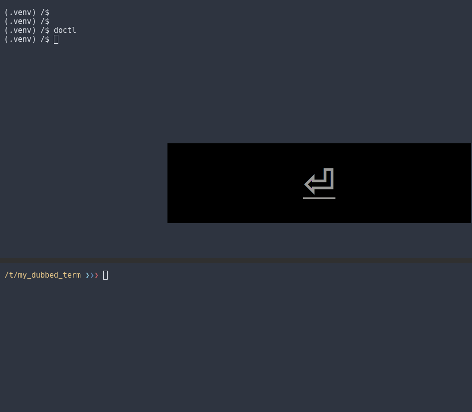

---

author: gk
version: 2021.05.01

---


# termcontrol

[](https://pypi.org/project/termcontrol/)

## Terminal Command Mode Support & I/O Multiplexing

The tool is a slightly extended terminal I/O stream hijacker, based on [https://github.com/j3parker/hijack.git](https://github.com/j3parker/hijack.git]).

But, instead of just forwarding stdin into the application, it allows to *modify* it, dynamically, before it hits the app. Stdout remains untouched, i.e. keeps as produced by the application.

Termcontrol also features a Python convenience wrapper.


## Purpose

### Multiplexing of Output

Tailing the out fifo duplicates the application's output into any other TTY byte by byte, i.e. not line-buffered, 
thus producing better results than `tee/tail -n` combinations - your colleague can watch you do, w/o having to use 
tmux or screen, simply via `tail -f` on the output fifo.

> Note: If you want `only` this, then the omnipresent `script` utility is a better alternative: `script -f <other tty>` on 2 terminals, with the `tty` command delivering their names. And, as for any use case related to stream control, `socat` would also be candidate - *if* you know how to configure it...

### Modification of Input

#### Stdin

Via command line parameters you can parametrize the tool to modify the stdin stream before forwarding it into the application, so that the application can bind to - and see hotkey combinations, w/o you actually typing them. This enables, with limitations, something like mode support (like vim's insert and normal mode), for otherwise mode unaware apps, e.g. fzf or ncdu, which you would have to reload to get new bindings. See the screencast below for an example.


#### External

Stdin is combined with what is read from the "in" fifo. Means:  

Any process, internal or external, with write perms on that fifo can control the app, incl. pressing hotkey combinations, simply by file writing of the appropriate bytes into the "in" fifo, e.g. `0x97` for `a`, `0x270x97` for `Alt-a` or `0x4` for CTRL-D.

Furthermore, termcontrol's own modification behaviour can be controlled by this, i.e. from inside or outside.

Example use case: The app offers a refresh hot key for the user and can spawn subprocesses. With termcontrol, such
a subprocess can trigger the refresh hotkey on its parent process once done, so the user sees the update automatically, when produced.


## Performance

When nodbody connects to the out fifo, then app performance is basically unchanged.

## Security

Only based on file permissions - root can always see what you see - and type (he could that anyways, just not that
convenient).


## Example

This is an application which uses fzf from a python process, to let the user select and filter lists.



- It uses termcontrol's python API in its main method, in order to get restarted within termcontrol like this:

```python
from termcontrol import wrap_process
d_io = wrap_process(cmd_mode=True, cmd_upper=True, ins_mode='/', cmd_signal=101,)
```

which means all lower case letters are converted to upper case ones already from app start - until '/' is entered. 

- Termcontrol by default listens to fast typed `jk` combinations, switching back to command mode.

- The `101` causes termcontrol to send an `alt-e` (`=alt+chr(101)`) into the app, when this happens.

- When running fzf, the python calling process configures it to bind (uppercase) K/J to up/down and H/L to application specific back/forward actions, plus has it change the prompt, based on `alt+e` or '/' seen, all features which fzf provides out of the box.

- When user hits `/`, termcontrol is switched to 'insert' (i.e. filter) mode, not modifying what is typed - j and k keys then filter the lists.

- The app can, from within, switch to control (normal) mode at every new list presented to the user, by calling the
  python api (which writes control sequences into the 'in' fifo).


## Testing

- pytest must run on Linux, w/o capture mode (`-s`)
- xdotool is used to send stdin keystrokes into the test program


## Installation

`pip install termcontrol`


